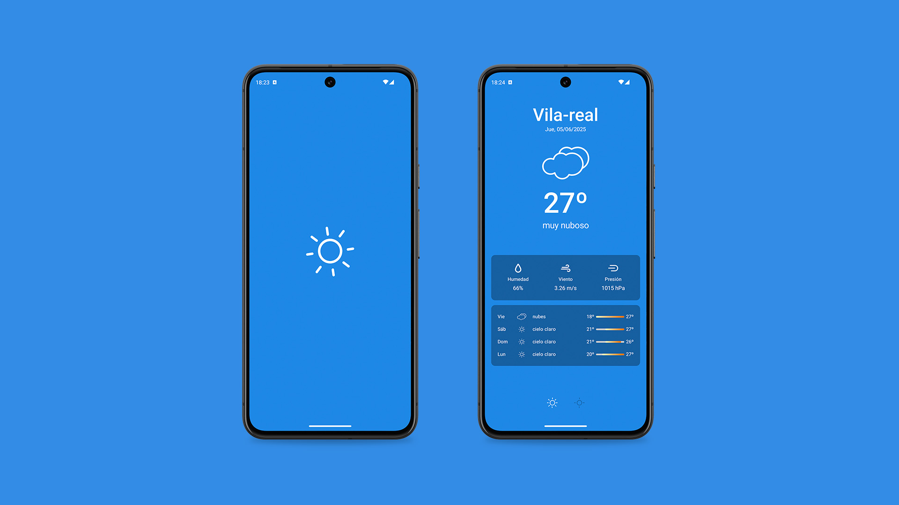

# Weather

**Weather** es una aplicación desarrollada en `Kotlin` con `Jetpack` (Room, ViewModel, Compose), `corrutinas`, `flow`, `livedata` y `Material Design` basado en `clean arquitecture` con un modelo de presentación `MVVM`.