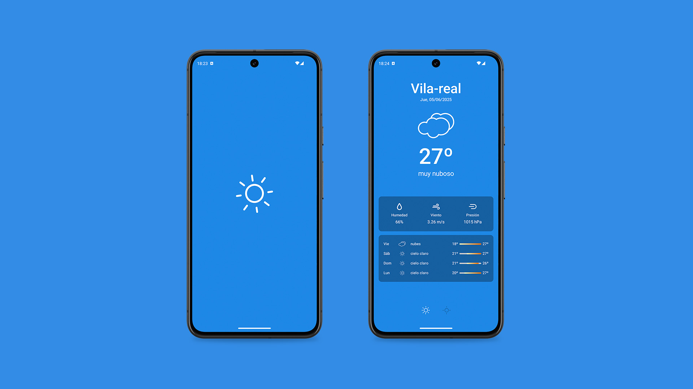
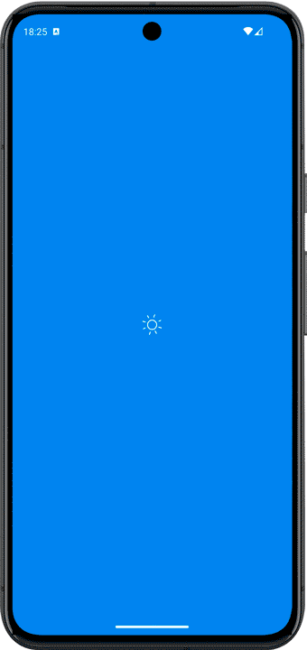

# Weather

> [English version / Versión en Inglés](README.md)

**Weather** es una aplicación desarrollada en `Kotlin` con `Jetpack` (Room, ViewModel, Compose), `corrutinas`, `flow`, `livedata` y `Material Design` basado en `clean arquitecture` con un modelo de presentación `MVVM`.

## Tecnologías y librerías

  

- Sdk mínimo: 28.
- [Kotlin](https://kotlinlang.org/) con [Corrutinas](https://github.com/Kotlin/kotlinx.coroutines), [Flow](https://kotlinlang.org/api/kotlinx.coroutines/kotlinx-coroutines-core/kotlinx.coroutines.flow/) y [Livedata](https://developer.android.com/topic/libraries/architecture/livedata?hl=es-419#create_livedata_objects) para operaciones asíncronas.
- Librerías Jetpack:
    - Jetpack Compose: librería moderna de Android para construir interfaces de usuario declarartivas.
    - ViewModel: maneja la lógica relacionada con la UI para que sobreviva a los cambios de configuración.
    - [Navigation](https://developer.android.com/develop/ui/compose/navigation?hl=es-419): Facilita la navegación entre pantallas. Complementado con [Hilt Navigation Compose](https://developer.android.com/develop/ui/compose/libraries?hl=es-419#hilt) para la inyección de dependencias, concretamente con el SharedViewModel.
    - [Room](https://developer.android.com/jetpack/androidx/releases/room?hl=es-419): Construye una base de datos con una capa de abstracción de SQLite para un acceso fluido a la base de datos de las ciudades.
    - [Hilt](https://dagger.dev/hilt/): Facilita la inyección de dependencias.
- Arquitectura:
  - MVVM: Modelo de presentación (Model - View - ViewModel): Facilita la separación de responsabilidades y promueve la mantenibilidad.
  - Clean Arquitecture: Separa la lógica en capas (datos, dominio y presentación) para una mejor organización y escalabilidad.
- [Retrofit2 & OkHttp3](https://github.com/square/retrofit): Para realizar peticiones HTTP a la API REST.
- [Kotlin Serialization](https://github.com/Kotlin/kotlinx.serialization): Serialización sin reflexión, multiplatafora y multi-formato.
- [ksp](https://github.com/google/ksp): Kotlin Symbol Processing para generación y análisis de código.
- [SplashScreen](https://developer.android.com/develop/ui/views/launch/splash-screen?hl=es-419#getting-started): API para crear pantallas de carga.

## OpenWeather API

La información del tiempo proviene de la API [OpenWeather](https://openweathermap.org/api)

## Licencia
Diseñado y desarrollado por AnnaSolox en 2025.

Este proyecto está bajo la licencia [Apache 2.0](./LICENSE).
No puedes usar este archivo salvo en cumplimiento con la Licencia.
Puedes obtener una copia de la Licencia en:

https://opensource.org/license/apache-2-0

A menos que lo exija la ley aplicable o se acuerde por escrito, el software distribuido bajo la Licencia se distribuye "TAL CUAL", SIN GARANTÍAS NI CONDICIONES DE NINGÚN TIPO, ya sean expresas o implícitas.
Consulta la Licencia para conocer el lenguaje específico que regula los permisos y limitaciones bajo la Licencia.
